# SmartBill Scanner

A Streamlit app to scan bills/receipts, extract items and amounts, categorize spending, and suggest saving tips.

## User Flow

```mermaid
flowchart TD
    A["User logs in or gets session"] --> B["Scans bill"]
    B --> C["OCR → Extracted items + total + category"]
    C --> D["Saved to DB with user_id + timestamp"]
    D --> E["User can view history on dashboard"]
```



## Setup

1. Install dependencies:
   ```
   pip install -r requirements.txt
   ```
2. Install Tesseract OCR (see https://github.com/tesseract-ocr/tesseract/wiki)
3. Train the model:
   ```
   python -c "from model import train_and_save_model; train_and_save_model()"
   ```
4. Run the app:
   ```
   streamlit run app.py
   ```

## Features

- OCR text extraction from images
- Item/amount/date parsing
- ML-based category prediction
- Smart saving tips 